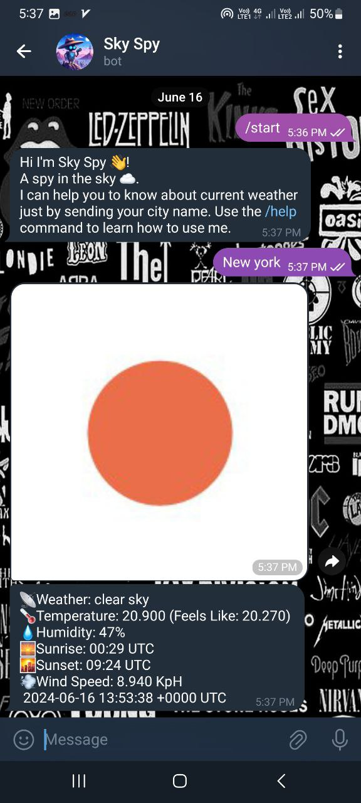

# Sky Spy Robot

Sky Spy Robot is a weather bot that provides real-time weather updates. It's written in Go and uses the OpenWeatherMap API to fetch accurate weather data. Additionally, Redis is used for caching to enhance performance.

## Features :sparkles:

- Real-time weather updates
- Accurate weather data from OpenWeatherMap API
- Caching with Redis for improved performance

## Usage

To use Sky Spy Robot, simply send a message with your city name to the bot (@Weatherforcastspy_bot), and it will reply with the current weather in your location.

<div style="text-align:center">
    
</div>

<div style="text-align:center">
    
</div>


```